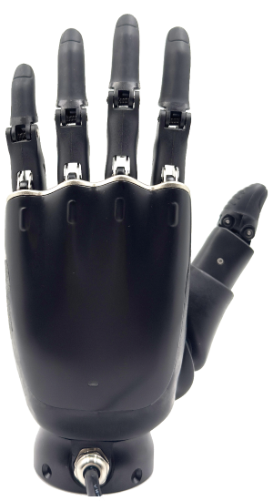

# Firmware, Protocol and Desktop Application for ROH-LiteS001 Dexterous Hand

Firmware, protocol and desktop application for ROH-LiteS001. See [README_EN.md](README_EN.md) for detailed information.

ROH-LiteS001 固件、协议文档和桌面端应用。请查看 [README_CN.md](README_CN.md) 以获取详细信息。

## Other links

ROS package:  [https://github.com/oymotion/rohand_ros_pkg](https://github.com/oymotion/rohand_ros_pkg)
ROS2 package:  [https://github.com/oymotion/rohand_ros2_pkg](https://github.com/oymotion/rohand_ros2_pkg)
ROS URDF package: [https://github.com/oymotion/rohand_lites_urdf_ros1](https://github.com/oymotion/rohand_lites_urdf_ros1)  
ROS2 URDF package: [https://github.com/oymotion/rohand_lites_urdf_ros2](https://github.com/oymotion/rohand_lites_urdf_ros2)  

ROHand only Examples: [https://github.com/oymotion/roh_gen2_demos](https://github.com/oymotion/roh_gen2_demos)  
Examples with Realman robotic arm RM65: [https://github.com/oymotion/roh_with_rm65](https://github.com/oymotion/roh_with_rm65)
